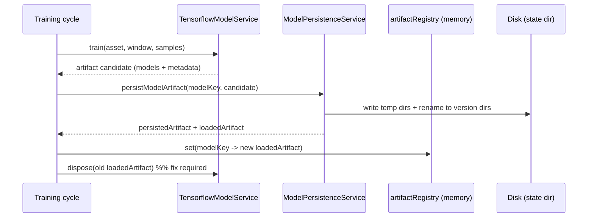

# Code Review of `polymarket-model` for a Dual-Model Polymarket Microstructure Strategy

## Executive summary

The repo is a well-structured long-running Node/TypeScript service that (a) ingests live snapshots into an in-memory buffer, (b) periodically trains and persists dual TensorFlow models, (c) restores latest model artifacts on restart, and (d) serves `/predict` responses that already contain a cost-aware fused trading decision (`shouldTrade`, `suggestedSide`, scores, vetoes). citeturn43view0turn13view0turn17view0turn29view0turn37view0

Two issues are **critical** for correctness and long-run stability:

- **Fee/cost model appears mathematically inconsistent with Polymarket’s published crypto fee formula** (crypto exponent is 2). Your current `buildEstimatedFee()` will materially misestimate taker fees (especially near p≈0.5), so the fused “net edge” scoring can be wrong. citeturn27view2turn28view0  
- **Model hot-swap leaks TensorFlow models**: retraining persists and installs a new artifact but **never disposes the previously loaded models** for that key (only disposed on shutdown). This will leak memory over time and can kill a months-long process. citeturn38view2turn38view0

Against your updated spec, the biggest strategy mismatch is architectural:

- **Trend models are not decoupled from windows**: the current design is explicitly “dual-model per `asset/window`”, and the trend feature set includes market/window-dependent fields (`t_to_end_norm`, `moneyness_*`, `price_to_beat`-related features), and trend sequence lengths differ by window. If you want a single per-asset crypto forecaster shared by both 5m/15m markets, this repo needs a structural refactor (not just tweaks). citeturn43view0turn20view0turn17view0

## Repo audit and module map

The repo layout is coherent: `src/` contains composition, HTTP server, snapshot store, and “model runtime” services; persistence is file-based with temp+rename; tests exist for most subsystems. citeturn43view0turn14view0turn40view0turn45view1

### File-to-responsibility map and immediate red flags

| File / module | Likely responsibility | Key observations / red flags |
|---|---|---|
| `src/main.ts` | Process entrypoint; start server/runtime | Standard composition; no obvious issues observed. citeturn12view2 |
| `src/config.ts` | All hyperparameters and operational knobs | Good: many tunables exist (training cadence, horizon, stale thresholds, fusion alpha, spread caps, etc.). Validate defaults vs RTDS 1s updates and your “continuous training” goals. citeturn6view0 |
| `src/http/http-server.service.ts` | HTTP API: `/`, `/models`, `/predict` | Input validation is minimal (asset/window only). Consider request body size/timeouts and JSON parse error handling. citeturn13view0 |
| `src/snapshot/snapshot-store.service.ts` | Live snapshot buffer (500ms default via `SnapshotService`) | Simple ring buffer; copy-on-read is good. No backpressure/health exposure for snapshot lag beyond downstream staleness gates. citeturn42view1 |
| `src/model/model-runtime.service.ts` | Orchestrates training cycles, model registry, prediction | **Critical leak**: swaps `artifactRegistry` entries without disposing old TF models. Training loops per asset/window. citeturn38view0turn38view2turn17view0 |
| `src/model/model-feature.service.ts` | Feature extraction; training sample/label building | Implements 30s horizon targets; enforces freshness for labels. Trend features include market/window geometry (breaks “trend decoupled from windows”). citeturn18view0turn20view0 |
| `src/model/model-context.service.ts` | Parse snapshot fields; compute staleness, mid/spread/depth/imbalance | Freshness checks (`chainlinkStaleMs`, orderbook stale) are clean and reused. JSON orderbook parsing per snapshot can be CPU heavy. citeturn22view0turn22view4 |
| `src/model/model-signal-cache.service.ts` | Cache derived signals; cross-asset leader/breadth metrics | Explicit directed leader weight table exists (good) and is used by features. citeturn24view2turn24view4 |
| `src/model/tensorflow-model.service.ts` | TFJS model build/train/predict; walk-forward folds | Walk-forward folds + embargo logic implemented. Important: dilations are effectively disabled (`dilationRate` forced to 1) due to tfjs-node limitation comment. citeturn31view6turn35view0 |
| `src/model/model-cost.service.ts` | Fusion logic, fee-rate fetch, slippage/spread buffers, veto rules | Good overall structure; **fee formula mismatch** vs Polymarket docs; fee-rate fetch has no retry/timeout. citeturn29view0turn28view0turn30view0 |
| `src/model/model-persistence.service.ts` | Save models + manifest; retention cleanup | Uses temp + `rename()` for atomic-ish disk writes; good pattern. citeturn37view0turn37view7 |
| `package.json` | Tooling/scripts/deps | Uses `@tensorflow/tfjs-node`, `tsx`, and has `test` script via custom runner. citeturn44view0 |
| `ecosystem.config.cjs` | PM2 process config | Minimal PM2 config exists; no Dockerfile found in root listing. citeturn45view0turn43view0 |
| `test/*` | Unit/integration tests | Tests exist for runtime, model-cost, model-feature, TF model, etc. (contents not inspected here). citeturn45view1 |

## Correctness checks vs your spec

### Spec compliance matrix

| Spec item | Status | Evidence / notes |
|---|---|---|
| Crypto model target = 30s **log-return** of RTDS (“Chainlink”) | **Implemented** | `trendTarget = log(P_t+30s / P_t)` with freshness gating. citeturn18view0 |
| CLOB model target = UP mid (or Δmid) | **Implemented** | `clobTarget` uses logit(mid); also stores `clobDirectionTarget` as Δmid. citeturn18view0 |
| Trend models **decoupled from window** (per-asset forecaster shared by 5m/15m) | **Missing / mismatched** | Design is per `asset/window`; trend feature names include window/market-time and moneyness features; trend seq lengths differ by window. citeturn43view0turn20view0 |
| CLOB models per asset-window | **Implemented** | Feature input keyed by `modelKey=asset_window`; active market required. citeturn18view0turn20view0 |
| Feature dictionaries (≤50) + directed cross-asset leader/follower rules | **Mostly implemented** | Trend/CLOB feature name lists are under 50 and include leader/breadth signals; leader weights explicitly defined. citeturn20view0turn24view2 |
| Staleness gating (Chainlink + orderbook) for live trading | **Implemented** | Global veto on `!isChainlinkFresh` and `!isOrderBookFresh`. citeturn29view0turn22view0 |
| Walk-forward-safe training (purge/embargo) | **Implemented** | Fold selection excludes samples whose span overlaps validation window ± embargo. citeturn35view1turn35view0 |
| Continuous training | **Implemented but coarse by default** | Training scheduled by interval; default looks like daily (config-driven). citeturn17view0turn6view0 |
| Fusion logic factoring fees/spread/slippage + veto rules | **Implemented but fee math likely wrong** | Fee-rate endpoint used; scoring and veto rules implemented; fee curve differs from docs. citeturn29view0turn30view0turn28view0 |
| Decision output schema for execution | **Partial** | `/predict` returns scores, vetoes, `shouldTrade`, `suggestedSide`; no canonical “order request” object (price/size/feeRateBps to sign). citeturn13view0turn16view0 |

### Targets and label correctness

- **Trend target**: For each decision time `t`, the label is `log(chainlinkPrice(t+30s)/chainlinkPrice(t))`, only if both current and target Chainlink prices are present, positive, and “fresh”. citeturn18view0turn22view0  
- **CLOB target**: For each `asset_window`, the label is `logit(up_mid(t+30s))` under active-market and freshness constraints; additionally `clobDirectionTarget = up_mid(t+30s) - up_mid(t)` exists, but the TF head appears to use the regression target encoding (`logit_probability`) instead of the Δ directly. citeturn18view0turn36view1

## Security, reliability, and performance review

### Long-run stability: model swap leak

During retraining, `trainModel()` persists a new artifact and then calls `applyPersistedArtifact()`, which overwrites the registry entry without disposing the previous TF models. Disposal only happens on `stop()`. In a continuously running service, that’s a gradual memory leak proportional to retraining frequency. citeturn38view0turn38view1turn38view2

### Fee-rate fetch reliability and cost correctness

- Your service correctly calls the documented `/fee-rate?token_id=...` endpoint and reads `base_fee` in bps. citeturn29view0turn30view0  
- However, Polymarket’s published fee formula for **crypto** is `fee = C × p × feeRate × (p × (1-p))^exponent` with exponent **2** (crypto). citeturn28view0  
- The current `buildEstimatedFee()` (as implemented) does not match that exponent-2 curve, so the computed `trendEdgeUp/Down` (which subtracts estimated fee/slippage/spread buffer from fair probability minus execution price) can be materially distorted. citeturn27view2turn29view0turn28view0  
- Operationally, `readFeeRateBps()` has **no retry/backoff or timeout**, so transient CLOB outages can force frequent vetoes (`fee_rate_unavailable_*`). citeturn29view0turn30view0

### TCN architecture mismatch in TFJS runtime

The TF model builder contains an explicit comment that tfjs-node cannot backprop conv gradients with dilation > 1, and forces `dilationRate` to 1 when a larger dilation is requested. That means your “TCN dilations” hyperparameters are not actually applied, and the receptive field is narrower than expected. citeturn31view6turn31view7

### Data quality and staleness handling

Staleness is computed as `generated_at - eventTimestamp` and gated via configured thresholds (`MODEL_CHAINLINK_STALE_MS`, `MODEL_POLYMARKET_STALE_MS`). Live trading is vetoed when stale, which is correct for safety. citeturn22view1turn29view0turn6view0

## Testing, observability, and deployment ops

### Tests

A `test/` suite exists for major parts: collector client, HTTP server, cost, features, persistence, runtime, and TF model. citeturn45view1turn44view0  
Without executing or opening each test file here, I cannot confirm whether the suite covers:
- the exponent-2 crypto fee curve against Polymarket’s fee table, or
- memory regression tests around retrain hot-swap.

### Observability gaps

You log training-cycle completions and persist a manifest of model statuses and versions, which is a strong baseline for debugging and restart continuity. citeturn17view0turn37view0turn39view5  
However, there is no explicit metrics endpoint (latency histograms, staleness rate, fee-rate fetch error rate). Recommendation: add an internal `/metrics` (Prometheus) or structured logs for:
- `predict_latency_ms`, `training_cycle_duration_ms`, `fee_rate_fetch_errors_total`, `chainlink_stale_veto_total`, `orderbook_stale_veto_total`, `model_version{model_key=...}`, `tf_memory_bytes` (if you instrument TFJS memory summaries).

### Deployment and atomic swap

- You have a minimal PM2 config that runs `node --import tsx src/main.ts` with `NODE_ENV=production`. citeturn45view0turn44view0  
- Disk persistence follows a safe temp-write then `rename()` approach for both model directories and `manifest.json`, which is the right atomicity pattern on a single filesystem. citeturn37view0turn37view7  
- You still need an explicit **in-memory swap discipline** (dispose old model after installing new model) to avoid leaks. citeturn38view2turn38view1

Mermaid: runtime data flow (training + inference)

```mermaid
flowchart LR
  A[polymarket-snapshot-collector] -->|HTTP readSnapshots| B[ModelRuntimeService]
  C[SnapshotService 500ms] --> D[SnapshotStoreService buffer]
  D -->|live snapshots| E[ModelFeatureService]
  B -->|merge + buildTrainingSamples| E
  E -->|ModelSequenceSample| F[TensorflowModelService]
  F -->|artifact candidate| G[ModelPersistenceService]
  G -->|manifest + model dirs| H[(disk)]
  D -->|/predict input| E
  E --> I[TensorflowModelService.predict]
  I --> J[ModelCostService.buildFusionPayload]
  J --> K[/predict response]
```

## Prioritized action list, code patches, and remediation timeline

### Critical (fix immediately)

**Fix Polymarket crypto fee curve (exponent=2)**  
Why: cost-aware decision is only as good as fee/slippage modeling; current curve disagrees with docs. citeturn28view0turn27view2  
Suggested PR title: `Fix crypto taker fee estimation to match Polymarket fee formula` (S)

```diff
diff --git a/src/model/model-cost.service.ts b/src/model/model-cost.service.ts
@@
   private buildEstimatedFee(feeRateBps: number | null, executionPrice: number | null): number | null {
-    const feeRate = feeRateBps === null ? null : feeRateBps / 10_000;
-    const estimatedFee =
-      feeRate !== null && executionPrice !== null ? this.executionSize * executionPrice * feeRate * executionPrice * Math.max(1 - executionPrice, 0) : null;
-    return estimatedFee;
+    const feeRate = feeRateBps === null ? null : feeRateBps / 10_000;
+    if (feeRate === null || executionPrice === null) return null;
+
+    // Polymarket docs: fee = C × p × feeRate × (p × (1 - p))^exponent; crypto exponent = 2.
+    // See: Trading > Fees (crypto) and /fee-rate response is base_fee in bps.
+    const p = Math.min(1, Math.max(0, executionPrice));
+    const exponent = 2;
+    const curve = Math.pow(p * (1 - p), exponent);
+    return this.executionSize * p * feeRate * curve;
   }
```

**Dispose old TF models on hot-swap**  
Why: continuous retraining otherwise leaks. citeturn38view2turn38view1  
Suggested PR title: `Dispose previous TF artifacts when swapping model versions` (S)

```diff
diff --git a/src/model/model-runtime.service.ts b/src/model/model-runtime.service.ts
@@
   private applyPersistedArtifact(
     modelKey: ModelKey,
     trainResult: ModelTrainResult,
     persistedArtifact: ModelArtifact,
     loadedArtifact: ModelLoadedArtifact,
   ): void {
-    const currentStatus = this.getStatus(modelKey);
-
-    this.artifactRegistry.set(modelKey, {
-      artifact: persistedArtifact,
-      loadedArtifact,
-    });
+    const currentStatus = this.getStatus(modelKey);
+    const previous = this.artifactRegistry.get(modelKey) || null;
+
+    // Install new model first (so a failure below never leaves us without a model).
+    this.artifactRegistry.set(modelKey, { artifact: persistedArtifact, loadedArtifact });
+
+    // Dispose the previous artifact to prevent long-running memory leaks.
+    if (previous !== null) {
+      this.tensorflowModelService.disposeArtifact(previous.loadedArtifact);
+    }
```

### Major (next)

**Decouple trend models from windows (architectural refactor)**  
Current repo explicitly keys trend sequence lengths and features by `asset_window`. citeturn43view0turn20view0turn17view0  
Suggested PR title: `Refactor: per-asset trend models shared across windows + per-market CLOB models` (L)

Minimal design outline (compatible with your “two-model strategy” spec):
- Introduce a separate key space, e.g. `TrendKey = asset` and `ClobKey = asset_window`.
- Split `artifactRegistry` into two registries or a single registry with `{ trendKey, clobKey }`.
- In `ModelFeatureService.buildFeatureInput()`:
  - `trendSequence` should be built from strictly crypto/venue features only (no `t_to_end_norm`, `moneyness_*`, `ptb_*`, `pm_live_flag` if you want pure crypto).
  - `clobSequence` retains market/window features.
- In `/predict`, always load the per-asset trend model and per-window clob model, then fuse exactly as you already do (time-weighting can remain window-dependent).

**Add timeout + retry/backoff for `/fee-rate`**  
`readFeeRateBps()` currently performs a single fetch and caches `null` on error. citeturn29view0turn30view0  
Suggested PR title: `Harden fee-rate lookup with timeouts, retries, and structured error reasons` (M)

### Medium / low priority

- **Make TF “TCN” closer to intended**: because dilation is disabled, either (a) rename the architecture to avoid false confidence, or (b) move to an architecture that TFJS supports reliably (e.g., GRU) for sequence modeling. citeturn31view6turn31view7 (M)  
- **Early stopping should reference validation**: `fitModel()` monitors `loss` only. Since you already compute validation predictions, consider tracking best checkpoint on validation metric and restoring best weights. citeturn32view1turn36view1 (M)  
- **Tighten “RTDS” freshness to reality**: default Chainlink staleness threshold is configurable; given 1s-ish updates, set it low (e.g., 3–5s) unless proven noisy. citeturn22view0turn6view0 (S)

### Remediation timeline

| Week | Milestone |
|---|---|
| Week 1 | Land both critical patches (fee curve + hot-swap dispose). Add/extend unit test to validate fee curve at p=0.5 matches doc table shape. citeturn28view0turn45view1 |
| Week 2 | Add fee-rate fetch timeout/retry + metrics for veto rates and fee-rate failures. citeturn29view0turn30view0 |
| Weeks 3–4 | Refactor to per-asset trend models (decouple from windows), keep per-window CLOB models; update feature sets and persistence schema/manifest accordingly. citeturn20view0turn37view0 |

### Security checklist

- **Secrets**: ensure any Polymarket API keys / signing keys are never committed; pass via environment + secret manager; confirm logs never print them (no evidence found either way in the reviewed files). citeturn44view0  
- **Dependencies**: run `npm audit` and pin/upgrade high severity items; `@tensorflow/tfjs-node` is a native dependency—prefer building in an environment matching your deployment OS/CPU. citeturn44view0  
- **Network hardening**: add timeouts/retries for all external calls (at least fee-rate; also collector client reads). citeturn29view0turn17view0  

Mermaid: model hot-swap (disk + memory)



### Tunable hyperparameters that should remain explicit

Keep these as config/env knobs (they already exist): horizon and decision cadence, stale thresholds, walk-forward window sizes and embargo, execution size used for effective price, max spread and spread-buffer kappa, fusion alpha schedule, and veto thresholds. citeturn6view0turn29view0turn35view0