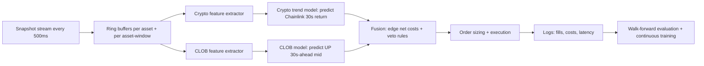
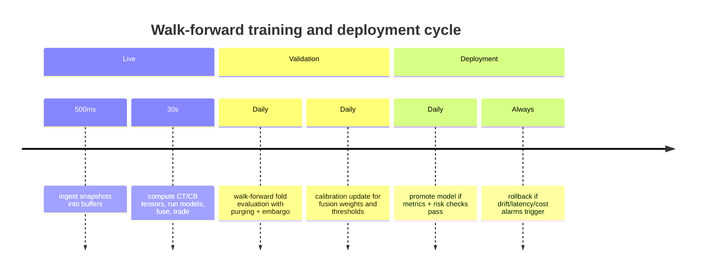

# TensorFlow Modeling and Feature Engineering for a Polymarket Microstructure Bot

## Executive summary

Your snapshot dataset (500ms default, wide/flat schema) is well-suited to a **dual-model trading system** that separates (a) an *underlying-crypto trend signal* from (b) a *Polymarket CLOB microstructure signal*, then fuses them into a cost-aware trading decision every 30 seconds. The recommended design is driven by three facts: (i) **Chainlink feeds are not streaming** and update only when **deviation/heartbeat** conditions trigger (so the primary crypto-model target must handle sparse/stepwise updates), (ii) Polymarket prices are **probabilities** derived from order-book supply/demand and the displayed price may switch from midpoint to last trade when spreads are wide, and (iii) short-horizon predictability in order-driven markets is often tied to **imbalance, spread, and depth** (the classic order-flow imbalance finding). citeturn6view0turn14view0turn16view1turn2search12

The report recommends:
- **Crypto-trend model target (required):** 30-second **Chainlink-based** log-return using a strict staleness gate and “forward-filled” Chainlink quotes (explicit formula below). citeturn14view0turn15view1  
- **CLOB model target (allowed):** 30-second-ahead **Polymarket UP midpoint price** (or its logit) computed from the UP book, not the displayed price field alone. citeturn19view0turn16view1turn17view0  
- **Losses:** multitask **Huber** (regression) + weighted cross-entropy (3-class direction head). Huber and causal convolutions are well-supported in Keras/TensorFlow, and TCNs explicitly enforce no future leakage via **causal** convolutions. citeturn5search2turn5search4turn0search11  
- **Model family:** **causal TCN** (primary) with a **GRU baseline**, because TCNs provide long effective memory with dilations and can be efficient at inference; GRUs are a standard gated RNN comparator. citeturn0search11turn3search3turn5search1  
- **Fusion for trading:** compute an **expected edge net of spread/fees/slippage** using (a) the crypto model’s implied “fair UP probability” from the Chainlink forecast and (b) the CLOB model’s predicted UP-price drift; then apply weighted scoring plus veto rules. Polymarket’s crypto markets have taker fees and an explicit fee-rate endpoint; the fee schedule peaks around 50% price and must be accounted for. citeturn12view1turn1search1turn18view1  
- **Validation:** walk-forward with **purging + embargo** around the 30s label horizon; report robustness using **Deflated Sharpe Ratio** and **Probability of Backtest Overfitting**-style diagnostics when doing extensive tuning. citeturn10search0turn10search1turn10search16  
- **Directed cross-asset features:** treat BTC as the dominant leader for spillovers (supported by crypto connectedness/spillover evidence) and explicitly encode leader→follower weighting rules; optionally refine weights by measured lead-lag correlations. citeturn2search3turn11search1

## Data semantics, alignment, and quality controls

Your dataset comes from a flat snapshot engine designed to emit one snake_case object for persistence (e.g., into entity["company","ClickHouse","columnar database"]), with configurable snapshot intervals and a default of 500ms. It includes per-asset crypto fields for entity["company","Binance","crypto exchange"], entity["company","Coinbase","crypto exchange"], entity["company","Kraken","crypto exchange"], entity["company","OKX","crypto exchange"], and entity["organization","Chainlink","oracle network"] (prices, order-book JSON for exchanges, and event timestamps); and per asset-window Polymarket fields (UP/DOWN price, UP/DOWN order-book JSON, market start/end, and `price_to_beat`). citeturn6view0turn9view0turn8view0

Key operational semantics from the snapshot engine that matter for modeling:
- Supported snapshot intervals are constrained (100/200/500/1000ms), default 500ms; supported assets default to btc/eth/sol/xrp; supported windows default to 5m/15m. citeturn8view0turn6view0  
- Market-window fields are included only when the snapshot timestamp is **inside** the live market interval (implemented via the “is_live_market” check before assigning per-market fields). citeturn6view0turn9view0  
- `price_to_beat` is fetched with an initial delay and retries (initial delay 10s, retry every 5s), which implies **missingness early in the market window** is expected and must be handled explicitly. citeturn8view0turn6view0  

### Data freshness and staleness gates

**Chainlink feeds:** Chainlink explicitly notes data feeds are not streaming; the onchain value updates when deviation exceeds a threshold or the heartbeat elapses, so updates can be sparse, and consumers must check timestamps (`updatedAt` / `latestTimestamp`) and implement safeguards when data isn’t recent enough. citeturn14view0turn15view1  
Implication: your Chainlink-return target will often be zero unless an update occurs within the 30s horizon; you must design targets/losses/features to model “update/no-update” regimes.

**Polymarket prices:** Polymarket prices are probabilities, and the displayed price is the midpoint unless the spread exceeds $0.10—in which case last trade is shown. The orderbook midpoint and spread definitions are explicit (midpoint = average of best bid and best ask; spread = best ask minus best bid). citeturn16view1turn19view0  
Implication: for CLOB modeling, compute mids/spreads from the order book JSON whenever available; treat the snapshot `*_up_price` as *a displayed proxy*, not ground truth.

**Polymarket order book schema:** The order book endpoint includes bids/asks (sorted), `tick_size`, `min_order_size`, `neg_risk`, `hash` and `last_trade_price`, all of which can be extracted if your `*_order_book_json` stores the full response. citeturn17view1turn19view3  
Implication: you can compute consistent microstructure features (mid, spread, depth, imbalance) and also detect book state changes (`hash`) without needing full depth.

### Inference cadence vs snapshot cadence

Even if you snapshot every 500ms, you trade every 30 seconds. Build training examples and live inference around **decision timestamps** spaced at 30 seconds:
- use the last \(L\) snapshots as the input sequence ending at decision time \(t\)
- predict targets at \(t+30s\)
This reduces label overlap and aligns the learning objective to your execution rhythm.

## Targets and losses for the crypto-trend model and CLOB model

This section provides explicit target formulas under your constraints: (a) crypto-model target must be Chainlink-based, (b) CLOB-model target may be UP price.

### Crypto-trend model target (Chainlink-based, required)

Let \(CL_a(t)\) be the latest observed Chainlink price for asset \(a \in \{\text{BTC, ETH, SOL, XRP}\}\) **at or before** time \(t\), forward-filled from the event stream, and let \(ts^{cl}_a(t)\) be its associated update timestamp.

**Staleness (seconds):**
\[
stale^{cl}_a(t)=\frac{t - ts^{cl}_a(t)}{1000}
\]

**Validity gate:** accept Chainlink at \(t\) only if
\[
stale^{cl}_a(t) \le \tau_{cl}
\]
where \(\tau_{cl}\) is a tunable parameter. Chainlink explicitly recommends checking timestamps and being prepared to pause/switch modes if updates are not recent enough; heartbeat values may be hours on some feeds, so \(\tau_{cl}\) must be set by your use case and risk tolerance. citeturn14view0turn14view2

**Primary regression target (30s log-return):**
\[
y^{CL}_a(t)=\log\left(\frac{CL_a(t+30)}{CL_a(t)}\right)
\]
computed only when both \(CL_a(t)\) and \(CL_a(t+30)\) pass the staleness gate; otherwise drop the sample.

**Direction label (3-class):**
Pick a small \(\epsilon_{CL,a} > 0\) (tunable, per asset):
- UP if \(y^{CL}_a(t) > \epsilon_{CL,a}\)
- FLAT if \(|y^{CL}_a(t)| \le \epsilon_{CL,a}\)
- DOWN if \(y^{CL}_a(t) < -\epsilon_{CL,a}\)

Why this matters: Chainlink updates occur on deviation/heartbeat triggers (not streaming), so the 30s-return distribution is typically **spike-at-zero + heavy tails** on update events; a 3-class head reduces instability from extreme class imbalance. citeturn14view0turn15view1

### CLOB model target (Polymarket UP price, allowed)

Let the Polymarket UP book for the relevant asset-window at time \(t\) have best bid \(b^{up}_1(t)\) and best ask \(a^{up}_1(t)\). Polymarket defines:
\[
mid^{up}(t)=\frac{b^{up}_1(t)+a^{up}_1(t)}{2}
\]
and midpoint is the implied probability shown on the UI (subject to a wide-spread fallback to last trade). citeturn19view0turn16view1

**Primary CLOB regression target (raw mid):**
\[
y^{UP}_{a,w}(t)=mid^{up}_{a,w}(t+30)
\]

**Recommended transformed target (logit for stability near 0/1):**
\[
z^{UP}_{a,w}(t)=\operatorname{logit}\left(\mathrm{clip}(mid^{up}_{a,w}(t+30),\epsilon_p,1-\epsilon_p)\right)
\]
with \(\epsilon_p\) small (e.g., 1e-4) to avoid infinities.

**CLOB direction label (3-class):**
Define \(\Delta mid^{up} = mid^{up}(t+30)-mid^{up}(t)\) and choose \(\epsilon_{UP,w}\):
- UP if \(\Delta mid^{up} > \epsilon_{UP,w}\)
- FLAT if \(|\Delta mid^{up}| \le \epsilon_{UP,w}\)
- DOWN if \(\Delta mid^{up} < -\epsilon_{UP,w}\)

### Loss functions (both models)

Use multitask loss:
\[
\mathcal{L}=\lambda_{reg}\cdot \mathrm{Huber}(y,\hat{y}) + \lambda_{cls}\cdot \mathrm{WCE}(c,\hat{p})
\]

- **Huber** is explicitly available as `tf.keras.losses.Huber`, with the standard quadratic-to-linear transition controlled by \(\delta\). citeturn5search2  
- **Weighted cross-entropy (WCE)** is recommended because both tasks tend to be imbalanced (Chainlink updates; UP-price direction).  

Recommended initialization:
- \(\lambda_{reg}=1.0\)
- \(\lambda_{cls}\in[0.3,0.8]\) (tunable)
- class weights: inverse-frequency capped (tunable)

### Why microstructure features are justified

Order-flow imbalance and depth have a documented short-horizon relationship with price changes in order-driven markets, with a linear relation between price changes and imbalance and slope inversely related to depth. This supports emphasizing imbalance, depth, and spread features for both exchange books and Polymarket books. citeturn2search12

## Single-model versus dual-model designs and live fusion rules

### Model variants

| Variant | What it does | Pros | Cons | Recommendation |
|---|---|---|---|---|
| Single integrated model | One model ingests both crypto + Polymarket sequences (two towers) and predicts trading target(s) | Potentially learns subtle cross-domain interactions end-to-end | Higher leakage/overfit risk; harder to debug; harder to “veto” bad CLOB regimes | Use as a later-stage experiment / ablation |
| Dual-model (trend + CLOB) | Crypto model predicts Chainlink 30s return; CLOB model predicts UP price drift/level; fuse | Modular, debuggable, supports validation/veto; easier continuous training per component | Requires careful fusion/calibration | Primary recommendation |
| Hybrid (dual + shallow meta-learner) | Train a small calibrator on the two outputs and market state | Can adapt weights over time | Adds another layer of overfit risk | Optional after walk-forward stability |

### Why dual-model is particularly appropriate here

- Chainlink’s update mechanism is deviation/heartbeat-driven, which means your crypto target is structurally different from Polymarket price dynamics; separating the models prevents one loss landscape from dominating the other. citeturn14view0turn15view1  
- Polymarket has explicit market microstructure mechanics (order book midpoint/spread, tick size, fee-rate schedule) and non-trivial taker fees on crypto markets; a specialized CLOB model can learn microstructure-driven short-horizon price drift under these constraints. citeturn19view0turn12view1turn17view1  
- Directed cross-asset effects (BTC leads alts) are empirically supported in crypto connectedness/spillover research and in high-frequency BTC→ALT lagged transmission evidence, which can be encoded cleanly in the crypto trend model and optionally echoed in the CLOB model as “breadth.” citeturn2search3turn11search1  

### Live fusion and decision rule (explicit formulas)

Define at decision time \(t\) for asset-window \((a,w)\):

- Crypto model outputs:
  - \(\hat{y}^{CL}_a(t)\): predicted Chainlink 30s log-return
  - \(\hat{p}^{CL,dir}_a(t)\): class probabilities (UP/FLAT/DOWN)

- CLOB model outputs:
  - \(\widehat{mid}^{up}_{a,w}(t+30)\) (or \(\widehat{z}^{UP}_{a,w}(t)\) then sigmoid)
  - \(\hat{p}^{UP,dir}_{a,w}(t)\): direction probabilities

#### Step A: Convert Chainlink forecast into an implied “fair UP probability”

Let:
- current Chainlink price \(CL_a(t)\)
- market strike/threshold \(B_{a,w}\) = `price_to_beat` (if available)
- time remaining \(\tau = \max(0, market\_end - t)\) seconds
- a volatility proxy \(\sigma_{30}(t)\) (computed from exchange composite returns over 30s, defined in features)

Define predicted 30s Chainlink price:
\[
\widehat{CL}_a(t+30)=CL_a(t)\cdot e^{\hat{y}^{CL}_a(t)}
\]

Define a diffusion-style fair probability (tunable model; treat as a calibration layer):
\[
\hat{q}^{trend}_{up}(t)=\Phi\left(\frac{\ln\left(\widehat{CL}_a(t+30)/B_{a,w}\right)}{\sigma_{30}(t)\sqrt{\tau/30}+\epsilon}\right)
\]
If `price_to_beat` is missing, skip fair-prob computation and rely more heavily on the CLOB model or do no-trade. The existence and delayed filling of `price_to_beat` is explicit in the snapshot engine. citeturn6view0turn8view0

#### Step B: Compute executable prices and costs on Polymarket

From the UP order book at \(t\):
- best ask \(ask^{up}(t)\)
- best bid \(bid^{up}(t)\)
- spread \(spr^{up}(t)=ask^{up}(t)-bid^{up}(t)\) (Polymarket’s definition). citeturn19view0turn17view1

Fees:
- fetch `base_fee` (basis points) via `GET /fee-rate?token_id=...` and treat it as \(feeBps(t)\). citeturn1search1turn12view2  
- crypto-market fee curve peaks at 1.56% around 50% price; Polymarket documents the shape and provides an explicit formula for fee computation (you should implement the exact curve from docs, not approximate). citeturn12view1turn12view2

Slippage:
- Either simulate by walking the local book depth, or use Polymarket’s `calculateMarketPrice` helper (documented in the public client docs) as a reference for estimating effective fill price for a given size. citeturn19view3

Treat all these as tunable components in backtest:
- execution latency \(L_{exec}\)
- slippage model / book-walk depth
- fee calculation implementation (exact per docs)

#### Step C: Compute net expected edge (UP side)

Define the **net edge** for buying UP:
\[
Edge^{trend}_{buy,up}(t)=\hat{q}^{trend}_{up}(t) - ask^{up}(t) - Cost_{buy}(t)
\]
where
\[
Cost_{buy}(t)=Fee(t, ask^{up}(t), size) + Slip(t,size) + \kappa\cdot spr^{up}(t)
\]
(\(\kappa\) is a tunable spread buffer factor, e.g. 0.5–1.0).

Define the CLOB model’s predicted movement edge:
\[
Edge^{clob}_{up}(t)=\widehat{mid}^{up}(t+30)-mid^{up}(t)
\]

#### Step D: Fuse into a final trade score (weighted + veto)

**Dynamic weight rule (example):**
Let \(u=\tau/T_w\in[0,1]\) be normalized time-to-expiry (T_w = 300s for 5m, 900s for 15m). Then:
\[
\alpha(u)=\mathrm{clip}(\alpha_0+\alpha_1\cdot u,\,0,\,1)
\]
Interpretation: earlier in the market window (larger \(u\)), weight trend more; near expiration, weight CLOB more (you can invert this if your backtests show the opposite).

**Final score:**
\[
Score_{up}(t)=\alpha(u)\cdot \frac{Edge^{trend}_{buy,up}(t)}{\widehat{CostScale}(t)}+(1-\alpha(u))\cdot \frac{Edge^{clob}_{up}(t)}{\widehat{VolScale}_{up}(t)}
\]

**Veto rules (recommended):**
- Do not buy UP if \(Edge^{trend}_{buy,up}(t) \le 0\) (trend must clear costs).
- Do not buy UP if the CLOB model strongly disagrees:
  \[
  \hat{p}^{UP,dir}_{DOWN}(t) > v_{down}
  \]
  for a tunable \(v_{down}\) (e.g. 0.6–0.8).
- Do not trade if Chainlink is stale beyond \(\tau_{cl}\) or Polymarket books are stale beyond \(\tau_{pm}\) (defined in feature rules); Chainlink explicitly advises timestamp-based freshness checks and pausing/switching modes if data isn’t updated in acceptable time limits. citeturn14view0

Repeat symmetrically for DOWN.

### Data-flow diagram for dual-model system



citeturn6view0turn8view0turn19view0turn12view1turn14view0

## Feature sets per asset-window with formulas and cross-asset directionality

This section specifies **two feature sets per asset-window** (≤50 each): one for the crypto trend model, one for the CLOB model. Features are defined so they can be computed at each snapshot time \(t_i\) inside the lookback window, producing an input tensor.

### Shared primitives used by many features

**Exchange book primitives (per exchange e, asset a, time t):** from best bid/ask levels:
- \(b_{1,e}(t), a_{1,e}(t)\)
- mid \(m_e(t)=\frac{b_{1,e}(t)+a_{1,e}(t)}{2}\)
- spread \(s_e(t)=a_{1,e}(t)-b_{1,e}(t)\)

**Top-k depth (k=3):**
\[
D_{e,k}(t)=\sum_{j=1}^{k} \left(v^{bid}_{e,j}(t)+v^{ask}_{e,j}(t)\right)
\]

**Top-k imbalance (k=1 or 3):**
\[
I_{e,k}(t)=\frac{\sum_{j=1}^{k} v^{bid}_{e,j}(t)-\sum_{j=1}^{k} v^{ask}_{e,j}(t)}{\sum_{j=1}^{k} v^{bid}_{e,j}(t)+\sum_{j=1}^{k} v^{ask}_{e,j}(t)+\epsilon}
\]

These imbalance/depth constructs are motivated by the documented short-horizon relation between order-flow imbalance and price changes and the role of depth in scaling the impact coefficient. citeturn2search12

**Polymarket book primitives:** analogous, using Polymarket’s explicit definitions for midpoint/spread and the book structure (bids sorted high→low, asks low→high). citeturn19view0turn17view1

### Normalization and missing-value rules (applies to both models)

**Robust scaling (recommended):** For each feature \(x\) (except probabilities/flags), compute median \(m_x\) and MAD-based scale \(s_x\) on the training window, then:
\[
\tilde{x}=\mathrm{clip}\left(\frac{x-m_x}{1.4826\cdot MAD_x + 10^{-8}}, -10, 10\right)
\]
(Implement once per model in the training pipeline and store scalers for inference.)

**Forward-fill + staleness:** For any stream value using `*_event_ts`, forward-fill between updates, but mark stale via explicit staleness features. For Chainlink, this is directly aligned with Chainlink’s timestamp-check guidance. citeturn14view0turn15view1

**Hard no-trade gates (live):**
- if Chainlink invalid at \(t\) by \(\tau_{cl}\): “no signal” state
- if UP/DOWN book invalid by \(\tau_{pm}\): no trade
- if `price_to_beat` missing and you require fair-prob conversion: no trade or CLOB-only conservative mode (tunable)

### Directed cross-asset features and leader/follower weights

Evidence supports BTC as a dominant driver of spillovers among cryptocurrencies, and high-frequency evidence suggests lagged transmission from BTC to altcoins with unidirectional Granger-causal patterns in some settings. citeturn2search3turn11search1

Define a directed influence weight table \(w_{a\leftarrow j}\) for target asset \(a\) influenced by asset \(j\). Initial weights (tunable):

| Target asset \(a\) | \(w_{a\leftarrow BTC}\) | \(w_{a\leftarrow ETH}\) | \(w_{a\leftarrow SOL}\) | \(w_{a\leftarrow XRP}\) |
|---|---:|---:|---:|---:|
| BTC | 0.00 | 0.20 | 0.05 | 0.05 |
| ETH | 0.60 | 0.00 | 0.10 | 0.10 |
| SOL | 0.60 | 0.30 | 0.00 | 0.10 |
| XRP | 0.60 | 0.25 | 0.15 | 0.00 |

Interpretation:
- BTC model: only light “regime confirmation” from others.
- SOL/XRP models: strong BTC leadership, moderate secondary ETH influence.

These are consistent with “BTC dominant contributor” spillover evidence and the BTC→ALT high-frequency transmission findings. citeturn2search3turn11search1

**Optional data-driven refinement (recommended):**
Estimate weights monthly (or weekly) by measuring lead-lag correlations:
\[
\rho_{a,j}(\delta)=\mathrm{corr}(r_a(t), r_j(t-\delta))
\]
for \(\delta \in \{0.5s, 1s, 2s, 5s\}\), then set
\[
w_{a\leftarrow j}\propto \max_{\delta}\max(0,\rho_{a,j}(\delta))
\]
and apply a prior constraint \(w_{a\leftarrow BTC}\ge w_{a\leftarrow ETH}\ge w_{a\leftarrow ALT}\) unless the data strongly contradicts.

### Crypto trend model feature set (CT) for each asset-window (48 features)

These features are computed per time step \(t_i\) in the input sequence. They are **shared across windows**, but the “market context” features (CT41–CT48) use the specific window’s `market_start/end` and `price_to_beat`.

**Notation:**
- \(P^{ex}_a(t)\): staleness-weighted composite of exchange mids (from Binance/Coinbase/Kraken/OKX), motivated by fragmented-market price discovery concepts. citeturn11search0turn6view0  
- \(CL_a(t)\): forward-filled Chainlink price
- \(r_x(\Delta)=\log(x(t)/x(t-\Delta))\)

| ID | Feature name | Exact formula (at time \(t\)) | Window | Missing rule |
|---|---|---|---|---|
| CT1 | `cl_log_px` | \(\log(CL_a(t))\) | instant | 0 if invalid |
| CT2 | `cl_stale_s` | \(stale^{cl}_a(t)\) | instant | +inf→cap(300) |
| CT3 | `cl_ret_30s` | \(\log(CL_a(t)/CL_a(t-30s))\) | 30s | 0 if invalid |
| CT4 | `ex_cl_basis` | \(\log(P^{ex}_a(t)/CL_a(t))\) | instant | 0 if invalid |
| CT5 | `ex_cl_basis_chg_5s` | \(CT4(t)-CT4(t-5s)\) | 5s | 0 |
| CT6 | `ex_logret_1s` | \(r_{P^{ex}}(1s)\) | 1s | 0 |
| CT7 | `ex_logret_5s` | \(r_{P^{ex}}(5s)\) | 5s | 0 |
| CT8 | `ex_logret_15s` | \(r_{P^{ex}}(15s)\) | 15s | 0 |
| CT9 | `ex_logret_30s` | \(r_{P^{ex}}(30s)\) | 30s | 0 |
| CT10 | `ex_mom_5s_mean` | mean of 0.5s log-returns over last 5s | 5s | 0 |
| CT11 | `ex_rv_10s` | \(\sqrt{\sum r^2}\) over last 10s (0.5s steps) | 10s | 0 |
| CT12 | `ex_rv_30s` | same over last 30s | 30s | 0 |
| CT13 | `ex_ret_accel` | \(CT6 - CT7/5\) | instant | 0 |
| CT14 | `ex_spread_med` | median\(_e\)\(s_e(t)\) over valid books | instant | 0 |
| CT15 | `ex_spread_wmean` | staleness-weighted mean spread | instant | 0 |
| CT16 | `ex_depth3_log` | \(\log(1+\) staleness-weighted mean of \(D_{e,3}(t)\)) | instant | 0 |
| CT17 | `ex_imb1_wmean` | staleness-weighted mean of \(I_{e,1}(t)\) | instant | 0 |
| CT18 | `ex_imb3_wmean` | staleness-weighted mean of \(I_{e,3}(t)\) | instant | 0 |
| CT19 | `ex_imb3_chg_5s` | \(CT18(t)-CT18(t-5s)\) | 5s | 0 |
| CT20 | `ex_disp_log` | staleness-weighted std of \(\log m_e(t)\) | instant | 0 |
| CT21 | `ex_disp_chg_5s` | \(CT20(t)-CT20(t-5s)\) | 5s | 0 |
| CT22 | `ex_best_stale_s` | min staleness of exchanges | instant | cap(30) |
| CT23 | `ex_mean_stale_s` | mean staleness of exchanges | instant | cap(30) |
| CT24 | `ex_valid_px_n` | count of exchanges with valid price | instant | 0 |
| CT25 | `ex_valid_book_n` | count with valid book | instant | 0 |
| CT26 | `binance_premium` | \(\log(m_{binance}(t)/P^{ex}_a(t))\) | instant | 0 |
| CT27 | `coinbase_premium` | \(\log(m_{coinbase}(t)/P^{ex}_a(t))\) | instant | 0 |
| CT28 | `okx_premium` | \(\log(m_{okx}(t)/P^{ex}_a(t))\) | instant | 0 |
| CT29 | `kraken_premium` | \(\log(m_{kraken}(t)/P^{ex}_a(t))\) | instant | 0 |
| CT30 | `leader_ret_5s` | \(\frac{1}{W_a}\sum_{j\ne a} w_{a\leftarrow j}\,r_{P^{ex}_j}(5s)\) | 5s | 0 |
| CT31 | `leader_ret_15s` | \(\frac{1}{W_a}\sum_{j\ne a} w_{a\leftarrow j}\,r_{P^{ex}_j}(15s)\) | 15s | 0 |
| CT32 | `leader_imb3` | \(\frac{1}{W_a}\sum_{j\ne a} w_{a\leftarrow j}\,CT18_j(t)\) | instant | 0 |
| CT33 | `breadth_ret_5s` | mean\(_{j\ne a}\) \(r_{P^{ex}_j}(5s)\) | 5s | 0 |
| CT34 | `disp_ret_5s` | std\(_{j\ne a}\) \(r_{P^{ex}_j}(5s)\) | 5s | 0 |
| CT35 | `btc_shock` | \(|r_{P^{ex}_{BTC}}(5s)|/\max(ex\_rv\_{10s}^{BTC},\epsilon)\) | 5s | 0 |
| CT36 | `eth_shock` | \(|r_{P^{ex}_{ETH}}(5s)|/\max(ex\_rv\_{10s}^{ETH},\epsilon)\) | 5s | 0 |
| CT37 | `pm_live_flag` | 1 if `asset_window_slug` non-null else 0 | instant | 0 |
| CT38 | `t_to_end_norm` | \(\min(\tau,T_w)/T_w\) | instant | 0 |
| CT39 | `t_from_start_norm` | \(\min(t-market\_start,T_w)/T_w\) | instant | 0 |
| CT40 | `ptb_missing` | 1 if `price_to_beat` null else 0 | instant | 0 |
| CT41 | `moneyness_log` | \(\log(CL_a(t)/B_{a,w})\) | instant | 0 if missing |
| CT42 | `moneyness_volnorm` | \(CT41/\max(ex\_rv\_{30s},\epsilon)\) | instant | 0 |
| CT43 | `moneyness_chg_30s` | \(CT41(t)-CT41(t-30s)\) | 30s | 0 |
| CT44 | `ptb_basis_ex` | \(\log(P^{ex}_a(t)/B_{a,w})\) | instant | 0 |
| CT45 | `ptb_basis_ex_chg_5s` | \(CT44(t)-CT44(t-5s)\) | 5s | 0 |
| CT46 | `cl_valid_flag` | 1 if Chainlink valid by \(\tau_{cl}\) else 0 | instant | 0 |
| CT47 | `cl_update_recent_60s` | 1 if \(stale^{cl}\le 60s\) else 0 | instant | 0 |
| CT48 | `ex_valid_gate_flag` | 1 if `ex_valid_px_n`≥2 else 0 | instant | 0 |

Chainlink-specific motivation (why CT2/CT46/CT47 exist): Chainlink explicitly recommends timestamp freshness checks and notes updates depend on deviation/heartbeat thresholds and can be delayed by congestion. citeturn14view0turn14view2  
Cross-asset leadership motivation (why CT30–CT36 exist): BTC dominance in spillovers and high-frequency BTC→ALT transmission evidence support directed features. citeturn2search3turn11search1

### CLOB model feature set (CB) for each asset-window (48 features)

These features are computed per time step \(t_i\) and are window-specific because Polymarket markets differ by window length and `price_to_beat`.

**Notation:**
- \(mid^{up}(t)\), \(spr^{up}(t)\), \(I^{up}_{k}(t)\), \(D^{up}_{k}(t)\) from UP book  
- analog for DOWN
- \(tick(t)\), \(minSize(t)\), `hash(t)` from orderbook response if stored citeturn17view1turn19view3

| ID | Feature name | Exact formula (at time \(t\)) | Window | Missing rule |
|---|---|---|---|---|
| CB1 | `up_mid` | \(mid^{up}(t)\) | instant | fallback to displayed up_price |
| CB2 | `up_spread` | \(spr^{up}(t)\) | instant | 0 |
| CB3 | `up_imb1` | \(I^{up}_{1}(t)\) | instant | 0 |
| CB4 | `up_imb3` | \(I^{up}_{3}(t)\) | instant | 0 |
| CB5 | `up_depth3_log` | \(\log(1+D^{up}_{3}(t))\) | instant | 0 |
| CB6 | `up_depth1_log` | \(\log(1+D^{up}_{1}(t))\) | instant | 0 |
| CB7 | `up_stale_s` | \((t-ts^{up}(t))/1000\) capped | instant | cap(30) |
| CB8 | `up_mid_chg_5s` | \(CB1(t)-CB1(t-5s)\) | 5s | 0 |
| CB9 | `up_spread_chg_5s` | \(CB2(t)-CB2(t-5s)\) | 5s | 0 |
| CB10 | `up_imb3_chg_5s` | \(CB4(t)-CB4(t-5s)\) | 5s | 0 |
| CB11 | `down_mid` | \(mid^{down}(t)\) | instant | fallback to displayed down_price |
| CB12 | `down_spread` | \(spr^{down}(t)\) | instant | 0 |
| CB13 | `down_imb1` | \(I^{down}_{1}(t)\) | instant | 0 |
| CB14 | `down_imb3` | \(I^{down}_{3}(t)\) | instant | 0 |
| CB15 | `down_depth3_log` | \(\log(1+D^{down}_{3}(t))\) | instant | 0 |
| CB16 | `down_depth1_log` | \(\log(1+D^{down}_{1}(t))\) | instant | 0 |
| CB17 | `down_stale_s` | \((t-ts^{down}(t))/1000\) capped | instant | cap(30) |
| CB18 | `down_mid_chg_5s` | \(CB11(t)-CB11(t-5s)\) | 5s | 0 |
| CB19 | `parity_gap` | \(mid^{up}(t)+mid^{down}(t)-1\) | instant | 0 |
| CB20 | `spread_sum` | \(spr^{up}(t)+spr^{down}(t)\) | instant | 0 |
| CB21 | `net_imb3` | \(I^{up}_{3}(t)-I^{down}_{3}(t)\) | instant | 0 |
| CB22 | `mid_skew` | \(mid^{up}(t)-mid^{down}(t)\) | instant | 0 |
| CB23 | `tick_size` | tick_size from orderbook JSON | instant | 0.01 (tunable fallback) |
| CB24 | `min_order_size` | min_order_size from orderbook JSON | instant | 1 (tunable fallback) |
| CB25 | `neg_risk_flag` | neg_risk from orderbook JSON | instant | 0 |
| CB26 | `book_hash_change` | 1 if hash(t) != hash(t-0.5s) else 0 | 0.5s | 0 |
| CB27 | `t_to_end_norm` | \(\min(\tau,T_w)/T_w\) | instant | 0 |
| CB28 | `t_from_start_norm` | \(\min(t-market\_start,T_w)/T_w\) | instant | 0 |
| CB29 | `ptb_missing` | 1 if `price_to_beat` null else 0 | instant | 0 |
| CB30 | `moneyness_log_cl` | \(\log(CL_a(t)/B_{a,w})\) | instant | 0 |
| CB31 | `moneyness_log_ex` | \(\log(P^{ex}_a(t)/B_{a,w})\) | instant | 0 |
| CB32 | `ex_rv_30s` | realized vol of \(\log P^{ex}_a\) over 30s | 30s | 0 |
| CB33 | `fair_q_up` | trend-implied \(\hat{q}^{trend}_{up}(t)\) (from fusion step) | instant | 0.5 if ptb missing |
| CB34 | `mispricing_mid` | \(CB33 - mid^{up}(t)\) | instant | 0 |
| CB35 | `mispricing_ask` | \(CB33 - ask^{up}(t)\) | instant | 0 |
| CB36 | `mispricing_bid` | \(CB33 - bid^{up}(t)\) | instant | 0 |
| CB37 | `leader_ret_5s` | as CT30 (directed weights) | 5s | 0 |
| CB38 | `leader_ret_15s` | as CT31 | 15s | 0 |
| CB39 | `breadth_pm_parity` | mean parity_gap of other assets same window | instant | 0 |
| CB40 | `breadth_pm_midup` | mean up_mid of other assets same window | instant | 0 |
| CB41 | `disp_pm_midup` | std up_mid of other assets same window | instant | 0 |
| CB42 | `up_down_stale_max` | max(CB7, CB17) | instant | cap(30) |
| CB43 | `up_down_stale_diff` | CB7 − CB17 | instant | 0 |
| CB44 | `spread_up_gt_10c` | 1 if up_spread > 0.10 else 0 | instant | 0 |
| CB45 | `spread_dn_gt_10c` | 1 if down_spread > 0.10 else 0 | instant | 0 |
| CB46 | `midpoint_vs_displayed_up` | \(mid^{up}(t)-up\_price\_displayed(t)\) | instant | 0 |
| CB47 | `midpoint_vs_displayed_dn` | \(mid^{down}(t)-down\_price\_displayed(t)\) | instant | 0 |
| CB48 | `pm_live_flag` | 1 if slug non-null else 0 | instant | 0 |

Why CB23–CB26 and book structure features matter: Polymarket orderbooks expose tick size, min order size, neg risk, and a hash to detect state changes, and bids/asks ordering is defined; midpoint/spread are defined and used as implied probability display. citeturn19view3turn17view1turn19view0turn16view1

### Per asset-window specification (what changes across btc_5m … xrp_15m)

The feature **formulas** above are constant, but each asset-window has:
- different \(T_w\): 300s for 5m, 900s for 15m
- different directed weights \(w_{a\leftarrow j}\)
- different “other assets same window” set for breadth features
- different liquidity/fee regimes in practice (calibration differs; see training and backtest)

| Asset-window | Directed weights used | \(T_w\) | Features used |
|---|---|---:|---|
| btc_5m | row BTC | 300 | CT1–CT48 and CB1–CB48 |
| btc_15m | row BTC | 900 | CT1–CT48 and CB1–CB48 |
| eth_5m | row ETH | 300 | CT1–CT48 and CB1–CB48 |
| eth_15m | row ETH | 900 | CT1–CT48 and CB1–CB48 |
| sol_5m | row SOL | 300 | CT1–CT48 and CB1–CB48 |
| sol_15m | row SOL | 900 | CT1–CT48 and CB1–CB48 |
| xrp_5m | row XRP | 300 | CT1–CT48 and CB1–CB48 |
| xrp_15m | row XRP | 900 | CT1–CT48 and CB1–CB48 |

## TensorFlow architectures, training, and continuous updating

### Recommended architecture family

**Primary:** causal TCN  
TCNs are characterized by **causal** convolutions (no future leakage) and can achieve long effective history using **dilations**, with strong empirical sequence-modeling results. citeturn0search11  
Keras supports `padding="causal"` for `Conv1D`, explicitly ensuring `output[t]` does not depend on `input[t+1:]`. citeturn5search4  
WaveNet popularized dilated causal convolution stacks for long context in temporal data. citeturn2search10

**Baseline:** GRU  
GRUs are a standard gated RNN; empirical evaluations show GRU can be comparable to LSTM while being simpler. citeturn3search3turn5search1

### Layer-by-layer architectures (TCN)

You will train **two separate models per asset-window**:
- Trend model: inputs are CT features (sequence tensor)
- CLOB model: inputs are CB features (sequence tensor)

Both share the same family; only hyperparameters vary.

#### Crypto trend model (CTCN) – TensorFlow/Keras layers

Input: \(X^{CT}\in \mathbb{R}^{L\times 48}\)

1. `Input(shape=(L, 48))`
2. `Dense(C)` + GELU
3. `B` residual TCN blocks:
   - `LayerNormalization`
   - `Conv1D(filters=C, kernel_size=3, dilation_rate=d, padding="causal")` + GELU citeturn5search4turn0search11
   - `Dropout(p)`
   - `Conv1D(filters=C, kernel_size=1, padding="same")`
   - Residual add
4. `GlobalAveragePooling1D`
5. Shared trunk: `Dense(128)` GELU → Dropout → `Dense(64)` GELU
6. Heads:
   - Regression: `Dense(1)` (predict \(\hat{y}^{CL}\))
   - Classification: `Dense(3)` logits (UP/FLAT/DOWN)

#### CLOB model (PTCN) – TensorFlow/Keras layers

Input: \(X^{CB}\in \mathbb{R}^{L\times 48}\)

Same structure; optionally use slightly higher capacity for SOL/XRP.

### GRU baseline (optional but recommended)

Input: \(X\in \mathbb{R}^{L\times 48}\)

1. `Input(shape=(L,48))`
2. `GRU(U, return_sequences=True, dropout=p, recurrent_dropout=0)` citeturn5search1  
3. `GRU(U, return_sequences=False, dropout=p, recurrent_dropout=0)`
4. `Dense(128)` GELU → `Dense(64)` GELU
5. Heads as above

### Hyperparameters per asset-window (actionable defaults)

Parameters differ by:
- window (5m vs 15m implies different typical regime/holding time; you can allow longer context for 15m models)
- asset (SOL/XRP may exhibit stronger BTC-driven nonlinearities; slightly more capacity)

| Model | \(L\) steps (@0.5s) | Lookback | Dilations | Blocks \(B\) | Channels \(C\) | Dropout \(p\) |
|---|---:|---:|---|---:|---:|---:|
| btc_5m CTCN | 128 | 64s | [1,2,4,8,16,32] | 6 | 32 | 0.10 |
| btc_15m CTCN | 180 | 90s | [1,2,4,8,16,32,64] | 7 | 48 | 0.12 |
| eth_5m CTCN | 128 | 64s | [1,2,4,8,16,32] | 6 | 32 | 0.10 |
| eth_15m CTCN | 180 | 90s | [1,2,4,8,16,32,64] | 7 | 48 | 0.12 |
| sol_5m CTCN | 128 | 64s | [1,2,4,8,16,32] | 6 | 48 | 0.12 |
| sol_15m CTCN | 180 | 90s | [1,2,4,8,16,32,64] | 7 | 64 | 0.15 |
| xrp_5m CTCN | 128 | 64s | [1,2,4,8,16,32] | 6 | 48 | 0.12 |
| xrp_15m CTCN | 180 | 90s | [1,2,4,8,16,32,64] | 7 | 64 | 0.15 |
| btc_5m PTCN | 96 | 48s | [1,2,4,8,16] | 5 | 32 | 0.10 |
| btc_15m PTCN | 128 | 64s | [1,2,4,8,16,32] | 6 | 48 | 0.12 |
| eth_5m PTCN | 96 | 48s | [1,2,4,8,16] | 5 | 32 | 0.10 |
| eth_15m PTCN | 128 | 64s | [1,2,4,8,16,32] | 6 | 48 | 0.12 |
| sol_5m PTCN | 96 | 48s | [1,2,4,8,16] | 5 | 48 | 0.12 |
| sol_15m PTCN | 128 | 64s | [1,2,4,8,16,32] | 6 | 64 | 0.15 |
| xrp_5m PTCN | 96 | 48s | [1,2,4,8,16] | 5 | 48 | 0.12 |
| xrp_15m PTCN | 128 | 64s | [1,2,4,8,16,32] | 6 | 64 | 0.15 |

TCN causal/dilated justification: core TCN property is preventing future leakage and enabling long receptive fields. citeturn0search11turn5search4

### Training hyperparameters (both models)

- Optimizer: Adam (well-suited for noisy/non-stationary objectives). citeturn3search5turn5search3  
- Loss: Huber + weighted CE. citeturn5search2  
- Learning rate schedule (tunable):
  - warmup to 1e-3 over first N steps
  - cosine decay to 1e-5
- Batch size: 256–1024 depending on hardware
- Gradient clipping: global norm 1.0
- Weight decay (L2): 1e-5
- Early stopping: patience 6–10 evaluation checkpoints; restore best

### Continuous training and validation strategy (walk-forward with purging/embargo)

Because your labels depend on \(t+30s\), naive splits leak information when feature/label windows overlap. A practical approach aligned with purging/embargo ideas in financial ML is to remove training samples whose feature or label intervals overlap the test fold, plus an embargo after the test fold. Purged k-fold CV and embargo concepts are described in the financial ML literature, and you should incorporate them to avoid optimistic leakage-heavy estimates. citeturn10search16turn10search1

**Actionable walk-forward plan (per asset-window, per model):**
- Sample decision points every 30s.
- Define each sample’s “span” as:
  - feature span: \([t-L\Delta, t]\)
  - label span: \([t, t+30s]\)
- For each test interval \([T_1,T_2]\), purge all training samples whose span intersects \([T_1, T_2]\) and embargo \([T_2, T_2+E]\) where \(E\) is tunable (e.g., 30–120s).
- Use rolling windows:
  - Train: last 14–30 days
  - Validate: next 2–3 days
  - Test: next 2–3 days
  - Roll forward

**Online updating (recommended operational policy):**
- Daily warm-start retrain using the last 14–30 days.
- Intraday: optional head-only fine-tune every 2–6 hours (only if drift monitors show degradation).

**Training timeline**



citeturn6view0turn10search0turn10search1

### Inference latency targets

Polymarket crypto markets have taker fees and spreads can be material; your signal must be timely to clear net costs. citeturn12view1turn19view0  
Targets (tunable engineering goals):
- Feature extraction per decision tick (all 8 asset-windows): ≤150–300ms
- Total inference (16 models): ≤50–100ms on CPU
- Snapshot→decision→order submission: ≤500ms (aggressive) to ≤1s (conservative)

## Evaluation, backtesting, and live risk controls

### Metrics (predictive)

Report per asset-window, out-of-sample walk-forward:
- Regression: MAE/RMSE on \(y^{CL}\) and on CLOB target (mid/logit-mid)
- Direction: macro-F1 for UP/FLAT/DOWN
- Calibration: reliability curves (especially for “UP update probability” behavior in Chainlink targets)
- Stability: performance by regime buckets (volatility, time-to-expiry, wide spreads)

Deep learning on limit order books (e.g., DeepLOB-class approaches) emphasizes robust out-of-sample evaluation across instruments and regimes; while your domain differs, the microstructure principle still applies. citeturn2search5turn2search12

### Metrics (trading)

Given the number of models/thresholds you will likely tune, report selection-bias-aware and overfitting diagnostics:
- Net PnL, gross PnL, turnover, max drawdown
- Sharpe/Sortino (with robust estimators)
- Deflated Sharpe Ratio (DSR) to correct for multiple testing and non-normality effects. citeturn10search0turn10search18  
- Probability of Backtest Overfitting (PBO) / CSCV-style diagnostics to quantify the chance your chosen “winner” is overfit. citeturn10search1

### Backtest design (microstructure-realistic)

A correct backtest must incorporate:
- **Execution latency** \(L_{exec}\) (tunable), and evaluate sensitivity to it.
- **Fill model**:
  - aggressive (marketable) orders: fill by walking the book levels
  - optional: use Polymarket’s documented capability to estimate effective market price by size as a cross-check of your book-walk logic. citeturn19view3turn17view1
- **Fees**:
  - implement fees per Polymarket’s documented formula and fee schedule; crypto fees peak around 1.56% near 50% probability and vary with price. citeturn12view1turn18view1
  - query `GET /fee-rate?token_id=...` and treat it as dynamic (do not hardcode). citeturn1search1turn12view2
- **Spread & slippage**:
  - spreads are defined as best ask minus best bid (explicit in docs), and midpoint is average of best bid and best ask. citeturn19view0  
- **Displayed price issue**:
  - if spread > 0.10, UI shows last trade instead of midpoint; therefore reliance on a single “price” field can introduce artifacts; compute mid from the book. citeturn16view1turn19view0

### Live risk controls (minimum viable)

Controls should directly map to documented failure modes and your observed data issues:

- **Chainlink freshness kill-switch:** if Chainlink has not updated within your acceptable limits, enter “pause or alternate mode,” consistent with Chainlink’s monitoring guidance. citeturn14view0turn14view2  
- **Polymarket liquidity guard:** do not trade when UP or DOWN spread is above a threshold or when book staleness exceeds \(\tau_{pm}\); midpoint/spread definitions and the wide-spread midpoint fallback behavior are documented. citeturn19view0turn16view1  
- **Fee guard:** do not trade if fee-rate and price regime imply cost > expected edge; Polymarket documents fee-enabled crypto markets and fee curve and provides fee-rate query endpoint. citeturn12view1turn1search1turn18view1  
- **Data completeness guard:** if the snapshot engine hasn’t populated `price_to_beat` yet (expected due to delayed fetching/retries), either skip trades requiring fair probability conversion or run a CLOB-only conservative mode. citeturn8view0turn6view0  
- **Inventory / exposure limits:** per asset-window max position, aggregate max, and a churn limiter to avoid overtrading under noisy signals (tunable).  
- **Rollback policy:** if live slippage/latency deviates materially from backtest assumptions, widen thresholds or stop trading until updated calibration.

## Feature extraction pipeline and schema transformations

### Snapshot field schema recap

The snapshot engine’s README defines the flat schema structure:
- `generated_at` + per-asset crypto fields (`btc_binance_price`, `btc_binance_order_book_json`, `btc_binance_event_ts`, …, `btc_chainlink_price`, `btc_chainlink_event_ts`)
- per asset-window market fields (e.g., `btc_5m_slug`, `btc_5m_market_start`, `btc_5m_market_end`, `btc_5m_price_to_beat`, `btc_5m_up_price`, `btc_5m_up_order_book_json`, …), included only during the market interval. citeturn6view0turn9view0

Configuration makes explicit the default intervals/assets/windows and the `price_to_beat` retry behavior. citeturn8view0

### Raw fields → derived feature mapping tables

**Crypto raw fields → CT features**

| Raw snapshot fields (prefix `a_`) | Used to compute |
|---|---|
| `a_binance_order_book_json`, `a_coinbase_order_book_json`, `a_kraken_order_book_json`, `a_okx_order_book_json` | best bid/ask, spreads, depth, imbalances → CT14–CT25, CT26–CT29 |
| `a_*_event_ts` | per-venue staleness → CT22–CT25 |
| `a_chainlink_price`, `a_chainlink_event_ts` | Chainlink price/staleness/basis → CT1–CT5, CT46–CT47 |
| cross-asset versions of the above | leader/breadth features → CT30–CT36 |

**Polymarket raw fields → CB features**

| Raw snapshot fields (prefix `a_w_`) | Used to compute |
|---|---|
| `*_up_order_book_json`, `*_down_order_book_json` | mid/spread/depth/imbalance/tick_size/hash → CB1–CB26 |
| `*_up_event_ts`, `*_down_event_ts` | staleness → CB7, CB17, CB42–CB43 |
| `*_market_start`, `*_market_end` | normalized time features → CB27–CB28 |
| `*_price_to_beat` | moneyness + fair-prob proxy → CB30–CB36 |
| other assets’ `*_up_order_book_json` etc. | breadth/dispersion → CB39–CB41 |

Polymarket orderbook responses include bids/asks, tick size, min order size, neg risk, and hash; midpoint/spread semantics are defined in docs. citeturn19view3turn19view0turn17view1

### Pseudocode for feature extraction (dual-model)

```python
# Pseudocode: deterministic transform from flat snapshots -> CT & CB tensors.

SNAP_STEP = 0.5  # seconds
DEC_STEP = 30.0  # seconds
H = 30.0         # horizon seconds

def parse_polymarket_book(book_json):
    # Expect bids/asks lists with price/size; may also include tick_size, min_order_size, hash.
    # See Polymarket get-order-book response fields.
    return book_dict_or_none

def best_bid_ask(book):
    bids = book["bids"]; asks = book["asks"]
    if len(bids)==0 or len(asks)==0: return None
    b1 = float(bids[0]["price"]); vb1 = float(bids[0]["size"])
    a1 = float(asks[0]["price"]); va1 = float(asks[0]["size"])
    return b1, vb1, a1, va1

def imb_k(book, k):
    vb = sum(float(x["size"]) for x in book["bids"][:k])
    va = sum(float(x["size"]) for x in book["asks"][:k])
    return (vb - va) / max(vb + va, 1e-9)

def depth_k(book, k):
    vb = sum(float(x["size"]) for x in book["bids"][:k])
    va = sum(float(x["size"]) for x in book["asks"][:k])
    return vb + va

def stale_s(generated_at_ms, event_ts_ms):
    if event_ts_ms is None: return 1e9
    return max(0.0, (generated_at_ms - event_ts_ms) / 1000.0)

def compute_exchange_mid(snapshot, asset, venue):
    # Similar to Polymarket book parsing but exchange-specific format.
    # If order book missing, fallback to price as a degenerate "mid."
    ...

def composite_exchange_price(snapshot, asset):
    # Build P^{ex}_a(t) from exchange mids with staleness weights
    # Require >=2 valid venues to declare valid; else return None.
    ...

def chainlink_price_ffill(chainlink_ring_buffer, t):
    # Most recent Chainlink <= t with its event_ts
    ...

def ct_features_at_t(snapshot_t, history_buffers, asset, window):
    # 1) compute P^{ex}_a(t), CL_a(t), price_to_beat etc.
    # 2) compute CT1..CT48 using exact formulas
    # 3) robust-scale using stored scalers
    return CT_vector_48

def cb_features_at_t(snapshot_t, history_buffers, asset, window):
    # 1) parse UP/DOWN books; compute mid/spread/depth/imbalance, hash, tick_size, etc.
    # 2) compute fair_q_up from (optional) chainlink+ptb+vol proxy
    # 3) compute CB1..CB48, robust-scale
    return CB_vector_48

def build_sequence(decision_time_t, snapshots, asset, window, L_ct, L_cb):
    CT_seq = [ct_features_at_t(snapshots[t_i], ..., asset, window)
              for t_i in last_L_times(decision_time_t, L_ct, SNAP_STEP)]
    CB_seq = [cb_features_at_t(snapshots[t_i], ..., asset, window)
              for t_i in last_L_times(decision_time_t, L_cb, SNAP_STEP)]
    return CT_seq, CB_seq

def make_labels(decision_time_t, asset, window):
    CL_t = CL(asset, decision_time_t)
    CL_f = CL(asset, decision_time_t + H)
    y_cl = log(CL_f / CL_t)
    up_mid_f = mid_up(asset, window, decision_time_t + H)
    y_up = up_mid_f
    return y_cl, y_up
```

### Tunable hyperparameters (explicit “open parameters” list)

These values must be tuned by walk-forward backtest and may differ by asset-window:
- staleness thresholds: \(\tau_{cl}\), \(\tau_{pm}\), per-exchange \(\tau_{ex}\)
- class dead-zones: \(\epsilon_{CL,a}\), \(\epsilon_{UP,w}\)
- fair-probability mapping parameters (vol proxy, diffusion scaling, \(\epsilon\))
- fusion weights: \(\alpha_0, \alpha_1\), veto threshold \(v_{down}\)
- execution assumptions: \(L_{exec}\), slippage model, spread buffer \(\kappa\)
- position sizing constraints and stop conditions
- training window lengths, embargo length \(E\), early stopping patience

Polymarket fees and fee-rate are explicitly dynamic (query endpoint) and fee curve is price-dependent; you should keep fee parameters as inputs to the edge computation rather than constants. citeturn12view1turn1search1